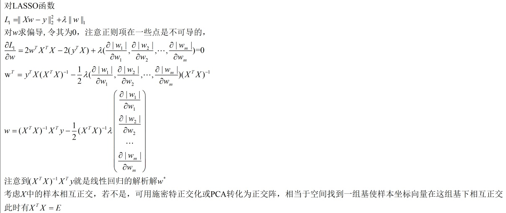
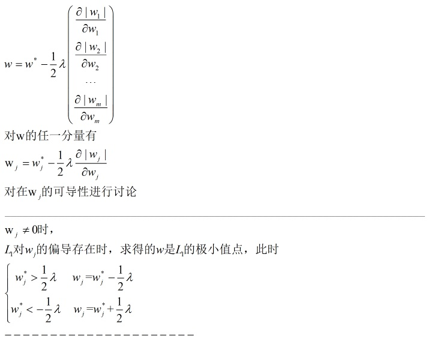
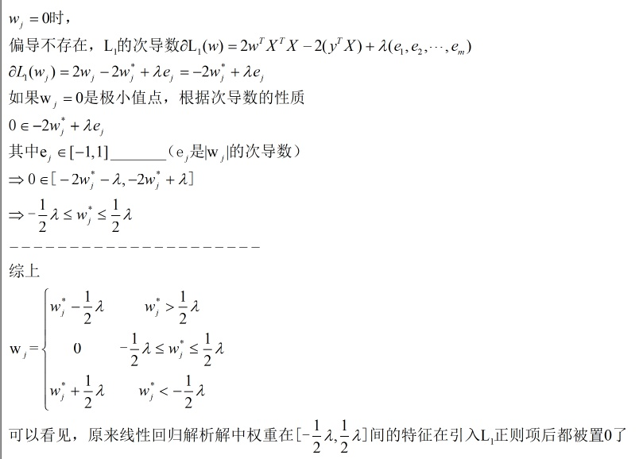

L1正则化需要注意的点:  
1. L1正则化的正则项在0点是不可导的，只存在次导数。这就是大家喜欢用L2正则化的一个主要原因，主要是编程简单。
2. L1正则化容易产生稀疏解。假设不加正则项前，线性回归的解是$W^*$, 加了正则项后线性回归的解$W$可以认为是原先的解$W^*$某种程度上的压缩。假设需要优化的函数如下:  
 $$L_1=||Xw-y||_2^2+\lambda||w||_1$$
 &ensp;&ensp;&ensp;&ensp;&ensp;最终解为  
$$w_j=
\begin{cases}
w_j^*-0.5\lambda,\text{ }w_j^*>0.5\lambda\\
0, \text{ } -0.5\lambda\leq w_j^*\leq0.5\lambda\\
w_j^*+0.5\lambda, \text{ }w_j^*<-0.5\lambda\\
\end{cases}
$$

可以看到原来的解在每个维度上都是往0压缩了  
  
  
  
