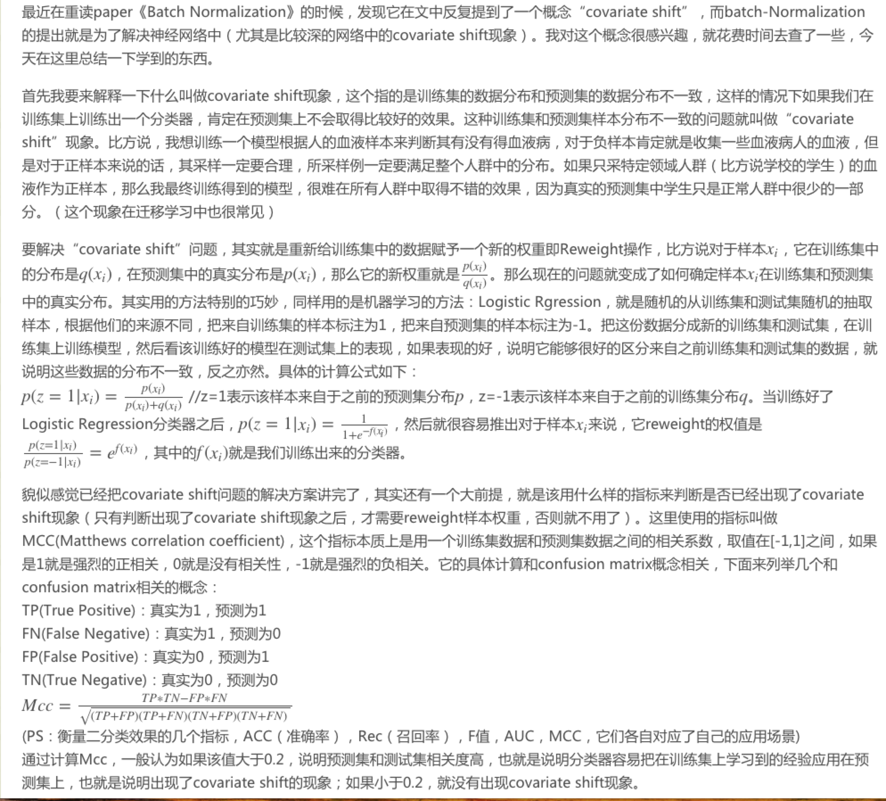
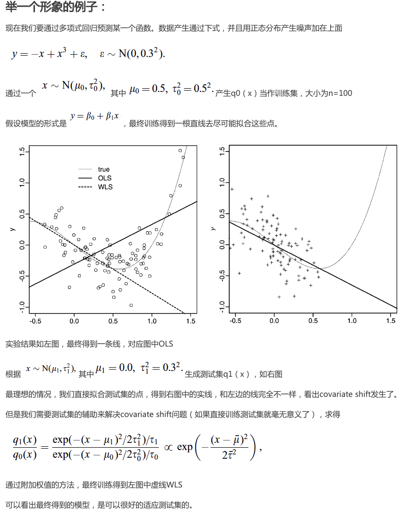

covariate shift(迁移学习中常用概念)
---
1. covariate shift问题是指样本点(x, y)在训练集和测试集上分布不一致，导致训练出的模型即使在训练集上获得了较好的结果，在测试集上未必能获得好的结果。  
2. 规范说法: 假设q1（x）是测试集中一个样本点的概率密度(这里概率密度可以认为是分布)，q0（x）是训练集中一个样本点的概率密度。最终我们估计一个条件概率密度p(y|x，θ)，它由x和一组参数θ=｛θ1，θ2......θm｝所决定。对于一组参数来说，对应loss(θ)函数评估性能的好坏。  
综上，当我们找出在q0（x）分布上最优的一组θ'时，能否保证q1（x）上测试时也最好呢？  
传统机器学习假设训练集和测试集是独立同分布的，即q0（x）=q1（x），所以可以推出最优θ'依然可以保证q1（x）最优。但现实当中这个假设往往不成立，伴随新数据产生，老数据会过时，当q0（x）不再等于q1（x）时，就被称作covariate shift
3. 如何解决？使用样本reweight。训练一个lr分类器来判别一个样本来自测试集还是训练集。

